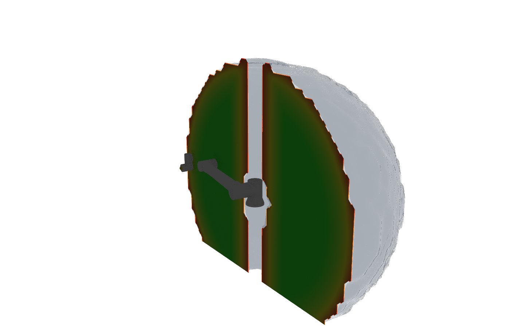
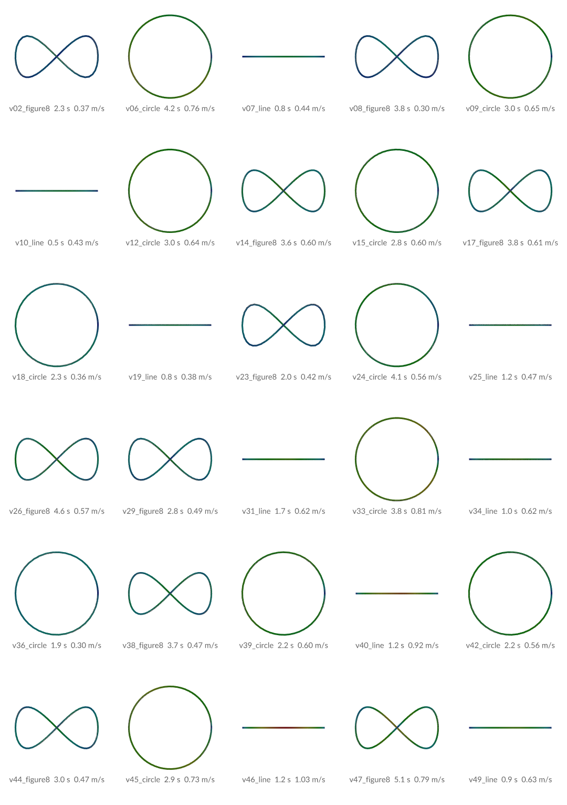
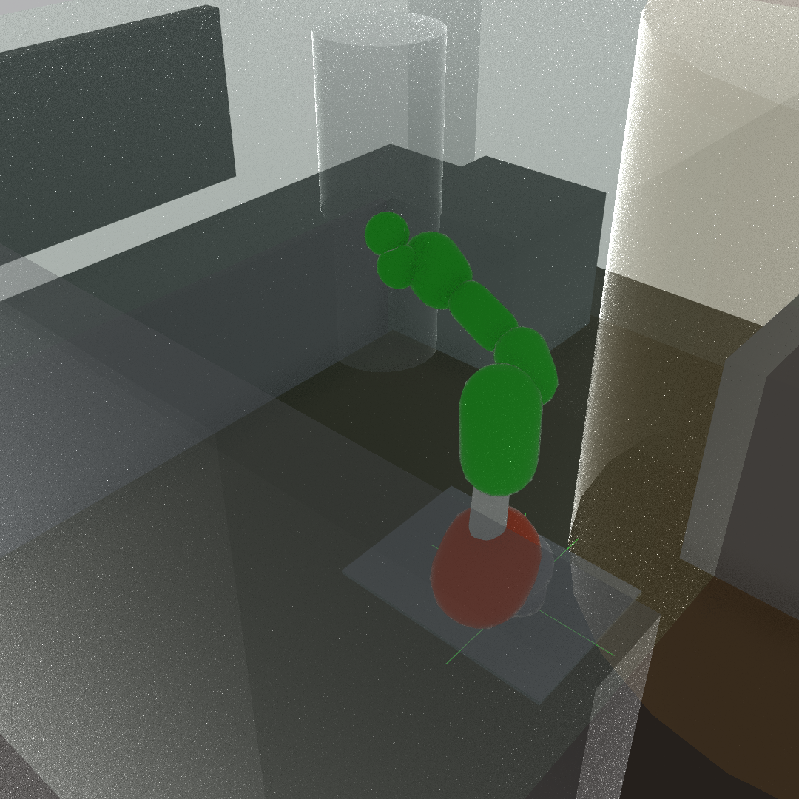
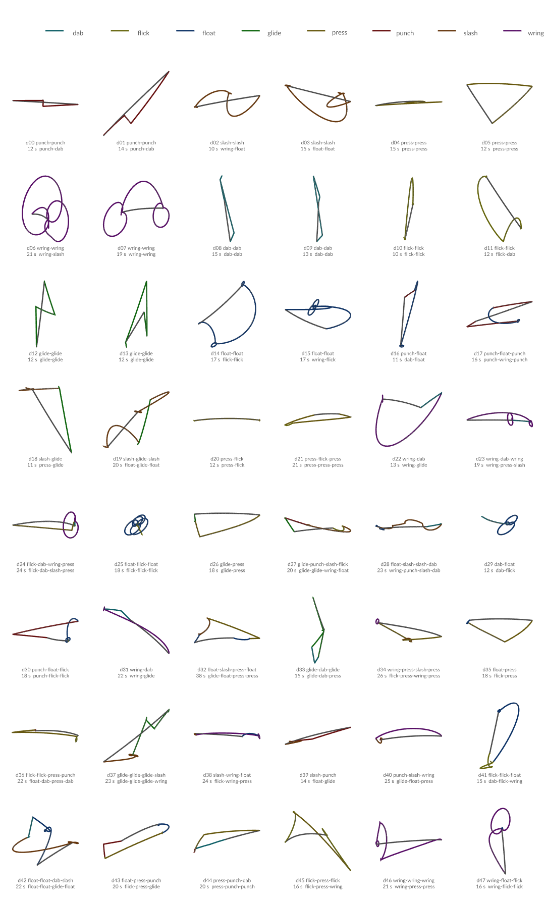
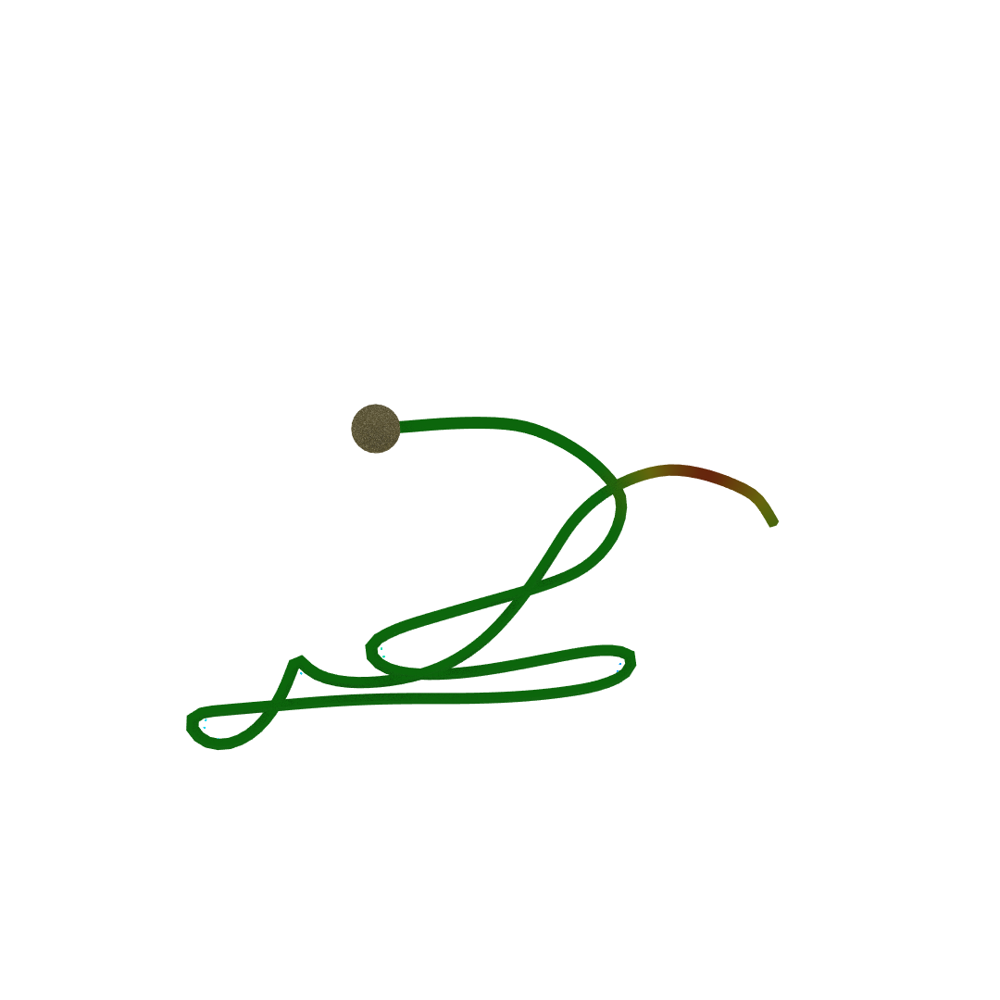

# houdini-robot-toolkit

Houdini toolset for animating a 6-axis robot arm — FK and IK, motion
analysis, and CSV export to a real controller.

Model-agnostic by design: the kinematic specification for a given arm lives
in `profiles/`, not in the assets. Two profiles so far: **UF850** (FBX rig) and
**Fairino FR20** (built from the vendor URDF). The asset reads the profile when
it cooks, so a *locked* instance follows whichever robot its Robot Profile
names — see [Profiles drive the asset](#profiles-drive-the-asset).

## Layout

| Path | Contents |
|---|---|
| `otls/` | Digital assets (runtime binaries) |
| `profiles/` | Per-robot spec JSON — joint limits, axes, sign conventions, output format |
| `scripts/` | Python and VEX extracted from the binaries, in diffable form |
| `scenes/` | `.hiplc` scene files |
| `assets/fbx/` | Source geometry |
| `assets/fairino_description/` | FR20 URDF and link STLs, copied unmodified from FAIR-INNOVATION/frcobot_ros2 (`fairino_description/`), which declares no license; the asset reads `urdf/fairino20_v6.urdf` and `meshes/fairino20_v6/*.STL` |
| `tests/csv/` | Reference fixtures for export/import validation |
| `tests/clips/` | Sample clips (JSON) from the dance factory |
| `tests/keypoints/` | A keypoint take (the retargeting input format) |
| `envs/` | Cells the robot works in: obstacles, keep-out / slow / work zones |
| `docs/images/` | Pictures the README shows |
| `docs/` | Design notes |
| `geo/` | IK solve cache — gitignored, regenerate with **Clear and Recache** |

## The asset

`wenyi::robot_arm::1.0` (`otls/sop_wenyi.robot_arm.1.0.hdalc`) wraps the whole
tool: 110 internal nodes, six tabs following the workflow.

| Input | |
|---|---|
| 0 | Rest skeleton — optional override of the profile's own (FBX or URDF) skeleton; the mesh still follows the profile |
| 1 | Goal curve |
| 2 | Goal point — overrides the built-in target when connected |
| 3 | **Tool geometry** — display only |
| 4 | Collision — **reserved, unused** |

| Output | |
|---|---|
| 0 | Display |
| 1 | **Tool Tip** — one point: `P`, `transform`, `orient` |
| 2 | Analysis |
| 3 | Posed Skeleton — the KineFX skeleton the active Pose Source produces |

Outputs 2 and 3 existed inside the asset and were labelled in its dialog
script, but the definition allowed only two outputs, so neither was reachable.
It now allows four.

## Tools

**Setup → Tool** sets the tool frame relative to the flange face, tool axis
+Y. The face is `joint_6` plus the profile's `flange_offset_m` along +Y — zero
on UF850, where `joint_6` is the face; 0.12 m on FR20, whose last joint sits
behind it. The IK goal is moved *back* by that frame so the **tip** lands on the
goal, and the solver keeps targeting `joint_6` exactly as before — no tool
means a bit-identical no-op.

**Tool Frame** decides where the TCP comes from:

- **From Geometry** (default) — read out of the mesh on input 3, in order:
  a point group called `tcp`, else a point named `tcp`, else the centroid of
  the points furthest along +Y. Wire a tool and the arm reaches with it.
- **Manual** — the numeric Tool Offset / Rotate

The switch lives in one place: `TCP_PATH_CTRL/tool_offset` takes
`tool_tcp_probe`'s `tcp_p` under From Geometry with input 3 wired, else the
typed offset, and the goal offset, `TOOL_TIP` and `joint_angles` all read it.
Rotation stays manual — the probe finds a point, not a frame. Until this was
wired, be5f879's probe and status shipped but the solve still read only the
typed offset, so a wired tool moved nothing. Checked on FR20 with an off-axis
tip at (0.03, 0.15, -0.02) m: the solved tip sits 154.3 mm from the flange
face (the tool's length) and lands on the goal to within the solver's own
residual.

Tool Status names the source and says outright when a tip was *guessed* from
extent rather than declared, so add a `tcp` point when it matters.

The centroid, not a single furthest vertex: on a tube the far points form a
ring, so picking one put the tip a tool-radius off axis.

Output 1 is the **achieved** tip, not the goal — the two differ by the tracking
residual.

The **analysis follows the tip too**: the achieved path, TCP speed and the
whole Analyze tab measure the working point, not the flange. On a 150 mm tool
that is not cosmetic — peak TCP speed read 0.61 m/s at the flange against
1.22 m/s at the tip, so the flange reading understated it by half.

> Appending a rigid `tool_tip` joint and retargeting FBIK at it does **not**
> work. The joint stays rigid correctly, but FBIK will not solve to a goal on
> an appended joint: zero weights, zero limits and untouched config all left
> every joint at 0.0 with an 886 mm residual.

Tabs: **Setup · 1 Motion · 2 Solve · 3 Analyze · 4 Output · Advanced**.

An internal `TCP_PATH_CTRL` null sits beside the VEX nodes so every
`ch("../TCP_PATH_CTRL/...")` reference inside the wrangles keeps resolving
untouched; its parameters are channel-referenced to the asset's. Input
parameters flow *down* (asset is master); status strings flow *up* (the inner
node writes, the asset mirrors).

The solve cache name is a **raw string with backtick expressions**, not a parm
expression — `setExpression` is flattened to a literal when the definition is
saved, which made every new instance inherit one stale path and overwrite its
neighbour's cache.

## Two selectors drive everything

**Goal Mode** — what the IK solver aims at:

| Mode | Position from | Notes |
|---|---|---|
| Manual Rig Pose | Manual TCP Goal parms | direct translate/rotate on the TCP |
| Curve | `CURVE_IN` sampled at Progress | |
| Point Transform | `POINT_IN`, else the built-in target | external input overrides the built-in |

Position and orientation are **independent**. All three orient modes work with
either goal source:

| Orient Mode | Curve goal | Point goal |
|---|---|---|
| Follow | curve **tangent** | the point's own orient (`transform` → `orient` → `N`+`up`) |
| Aim At Target | point the tool at Aim Target | same |
| Fixed Direction | Fixed Tool Direction + Roll | same |

`Point Roll` adds spin about the tool axis on top of the point's orientation.

**Aim Target Source** is either Manual XYZ or **From Object**. The object may be
either:

- **SOP geometry** — aims at point 0 (an Add or Transform SOP works)
- **An OBJ node** — aims at its origin (a null you drag in the viewport)

Aim Object Status states which was resolved and how, so a silent zero is not
mistaken for a working target. Relative paths are resolved against the asset,
which is where you type them.

**Pose Source** — what actually drives the deformed robot *and* the CSV
exporter: FK (manual joints) / IK (solved) / Imported CSV / Baked IK→FK.

Manual FK is typed into `Joint_controller`'s `j1`–`j6` in the **robot frame**,
clamped to the profile's limits. The profile's sign is applied on the way to
the Rig Pose, so what you type is what the CSV exports.

`COLLISION_IN` is a reserved, unconnected wiring point. Collision avoidance is
not implemented.

## `$HIP` is not the project root

Scenes live in `scenes/`, so `$HIP` resolves to that folder. Project-relative
paths inside a scene use `$HIP/../`:

```
$HIP/../assets/fbx/uf850_fk_01.fbx
$HIP/../geo
$HIP/../tests/csv/test01_houdini.csv
```

`$JOB` would read better but needs environment setup to be reliable. `$HIP/..`
resolves correctly on a fresh clone with no configuration.

## scripts/ vs otls/

`otls/` holds what Houdini runs. `scripts/` holds the same code as text so it
can be reviewed and diffed — a change inside a `.hdalc` is otherwise invisible
in a commit. Treat `scripts/` as the readable copy, and keep it in sync when
the asset changes.

`joint_angles_sop.py` had drifted: the readable copy carried the "analysis
follows the tool tip" block (d916492) but the asset never did — that commit
changed a scene instance, not the definition. The asset now runs the copy.

## Profiles drive the asset

Until now three things inside `wenyi::robot_arm` were written for UF850 only,
although limits and presets already came from the profile: the axis each joint
turns about (J5 pinned to z) and literal J2/J4/J6 limits in `configurejoints1`;
the FK axis per joint and J3's sign as a literal `-1` in `rigpose_fk`; and
UF850's limits baked into the `fk_j1..6` slider templates as strict ranges.

They are now **expressions** on the internal nodes, evaluated against the
current profile by the asset's PythonModule (`scripts/hda/robot_arm_module.py`).
Not a callback that writes them: a locked instance forbids writes to internal
parameters, so a callback would only ever have worked on an unlocked copy.

What a callback still does — `on_profile_changed()`, run by the Robot Profile
menu and on creation — touches only promoted parameters: the `invert_jN`
toggles from the profile's sign, Robot Mesh on when the profile has a body
(FBX or URDF) and off when it has neither, and the Configuration presets via
`cfg_reset`. The menu lists every
`profiles/*.json`.

The FK sliders are now plain ±360 °; `Joint_controller` clamps each one to the
profile's limit.

**Solve cache path.** `cache_solve`'s basename was the literal
`ik_solve_uf850_robot_arm`, not a reference to `cache_name`, so every instance
in every scene shared one folder — and Recache deletes the matching files
before writing. It now follows `cache_name` (`ik_solve_<profile>_<node>`). An
instance named `robot_arm` on UF850 resolves to the same folder as before;
any other name gets its own and needs one recache.

**Checked against a baseline.** Before any of this, a fresh UF850 instance was
recorded over four FK poses and three IK goals (skeleton P/transform, tool tip,
residuals, joint config). After each change a fresh locked instance matched it
except for the cache path and J2's range, which moved from the literal ±132 to
the profile's ±131.9.

## Adding a robot from a URDF

`scripts/urdf_rig.py` builds the rest skeleton and places the link meshes from
a URDF. KineFX wants +Y down each bone; a URDF turns every joint about its own
local z, Z-up. So each joint frame is rebuilt from where the joints are and
which way each turns, and classified: `y` where the axis runs along the bone
(a twist), `z` where it is perpendicular (a hinge). A skewed joint raises
rather than producing a wrong rig.

`python scripts/urdf_rig.py` checks, for FR20: frames orthonormal and
right-handed, +Y down every bone at rest and posed, +25° in reads +25° out on
every joint, upper arm + forearm + J5→J6 = the datasheet's 1854 mm, and that
`profiles/fr20.json` states the same axes, signs, limits and flange offset the
geometry does.

The asset does this itself. When a profile names `rig.urdf` and no `rig.fbx`:

| Node | |
|---|---|
| `urdf_skeleton` | Python SOP — the rest skeleton, into `SKEL_SOURCE` (input 2) |
| `urdf_links` | Python SOP — one rigid STL per link at the URDF zero, prim `name` = the joint that moves it (`base` for the static link). STLs are reversed on load: their CCW winding points every face inward in Houdini |
| `urdf_normals` | vertex N, cusp 45° — CAD tessellation smears under point normals |
| `urdf_drive` | Transform Pieces — each link from `to_fk_ik` (rest) to `POSE_SOURCE` (posed) |
| `ROBOT_MESH_SOURCE` | switch — FBX skin (`out_robot`) or URDF links (`urdf_robot`), into Robot Mesh |

Both switches are Python expressions (`skel_source`, `mesh_source` in the
module), so a locked instance follows the profile. Mesh paths are
`package://` URIs, resolved the ROS way: the URDF sits at
`<package_root>/<package>/urdf/`. Nothing is wired outside — dropping the
asset and picking `fr20` is the whole setup. Input 0 still overrides the
skeleton when wired, but the links stay placed for the URDF's own rest, so
only wire one that matches it.

`scenes/FR20_rig.hiplc` is that: one locked `robot_arm`, profile `fr20`, no
inputs. On a fresh locked instance, FK matches URDF forward kinematics to
4 µm, every link-mesh vertex matches its STL placed by URDF FK to 5 µm, and
IK → extracted angles → URDF FK lands on the solved tool tip to 2 µm.

## Closed-form IK (UR-type arms)

`rig.ik_solver` in the profile picks the solver: `fbik` (default, UF850) or
`ur_closed_form` (FR20). The closed form is `scripts/ur_ik.py`, pure Python:
it checks the URDF is UR-type (J2/J3/J4 parallel, J5 ⟂ J4, J6 ⟂ J5), derives
the solve from the URDF's own zero-pose geometry — no DH table, so no angle
offsets or signs to transcribe — and returns every branch, up to 8
(shoulder × elbow × wrist). Each branch is polished by a few Newton steps on
the exact URDF (its π/2 is written 1.5708) and kept only if it reproduces the
goal to 1 µm / 1e-6 rad. `python scripts/ur_ik.py` runs its tests: over
10,000 random in-limit poses every branch reproduces its target (worst
4e-12 m), and away from singularities the pose's own q is always among them.
Near the wrist, elbow or shoulder singularity branches merge or a family of
solutions reaches the same pose, so there only exactness is checked.

Inside the asset: `analytic_ik` (Python SOP) solves the joint_6 goal from
`tool_goal_offset`, writing `ik_q` / `ik_ok` / `ik_singular` / `ik_nsol` /
`ik_branch` as detail attributes; `ik_rigpose` — a copy of `rigpose_fk` —
poses the skeleton from them; `IK_SOLVER` switches between that and
`fullbodyik1`. Everything downstream is unchanged.

Branch choice per frame: the Solve tab presets (shoulder / elbow / wrist)
filter the branches — the usual industrial configuration flags — and the one
nearest the previous frame's solution wins, else the one nearest
`rig.ik_reference_deg`. Recache clears that memory and writes frames in
order, so a cached solve is continuous and reproducible. With no admissible
branch (out of reach, or all outside limits / presets), `closest()` gets as
near as the arm can from the previous pose — Levenberg–Marquardt, clamped to
the limits — and `ik_ok` reads 0.

Measured on FR20, locked instance:

| | FBIK | closed form |
|---|---|---|
| Manual goals, residual | 3–24 mm | 0.0001–0.0008 mm (an out-of-reach one: 3.2 mm) |
| Drawn curve, 240 frames | 67 frames > 1 mm, max 134 mm | all solved, max 0.005 mm |
| Branch changes on the curve | wrist flips mid-branch | 4, each forced: the branch it left needed J1 −175.7 / −175.3, J6 176.1 or J4 95.0 |
| Against the FR20 controller (SimMachine) | — | its `GetInverseKin` answer is among our branches for 18/18 poses, to within its 0.001-unit output rounding |

Joint steps above the velocity limit remain on that curve where the curve
itself asks for them — passing near the wrist singularity (q5 ≈ −10°: J4/J6
turn 8–14°/frame while the goal turns 2°) and at the four forced branch
changes. That is the curve, not the solver; Pre-flight flags it.

## Capability atlas (FR20)

What the arm can do at each point of its workspace, baked into volumes so
paths can be designed against it rather than discovered by Pre-Flight.
`scripts/capability.py` measures a TCP target over every IK branch within
the limits; `scripts/hda/atlas_sop.py` fills a grid with it:

| Field | Meaning |
|---|---|
| `reachable` | 1 if the tool reaches the point pointing along Tool Direction |
| `headroom` | m/s: fastest TCP speed in the *worst* direction, orientation held, before a joint hits its velocity limit. 0 at a singularity |
| `wrist` | \|sin q5\|: 0 at the wrist singularity (where J4/J6 blow up) |
| `margin` | degrees to the nearest joint limit |
| `nsol` | branches within limits |
| `capability` | Mode Capability only: fraction of 26 tool directions that reach it |

**Build and bake** (headless, `hython` from the Houdini install):

```
hython scripts/build_atlas_scene.py --bake
hython scripts/atlas_check.py
```

`scenes/FR20_atlas.hiplc` is generated by the first line (rebuild it rather
than hand-edit it). Its TOP network `/obj/atlas_tops` wedges the grid into
Slabs along Y and bakes them in parallel with ROP Geometry Output into
`geo/atlas/v<voxel>mm/` (gitignored). At 10 cm: 43 x 34 x 43 voxels, 89 s
of solving done in 23 s over 8 work items. PDG reuses existing slab files:
delete the folder (or the bake node's output files) after changing the bake.

**Looking at it** — open the scene; `/obj/fr20_atlas/OUT` shows:

- a **half shell** (`reach_shell` → `shell_cutaway`): the iso-surface of
  `reachable`, the +Z half cut away so the inside shows;
- a **slice** (`slice` grid → `slice_look`) through the base, only where the
  tool reaches, coloured by `headroom`: green is fast, red is slow / near a
  singularity (Green At, m/s). Move or turn the grid (Center, Orientation)
  to scan the workspace; middle-click a point for its `headroom` / `wrist`.



With the tool pointing down, two regions stand out: the band around the J1
axis, where a UR-type arm cannot put its wrist, and the rim of the reach,
where the arm is nearly straight and slow.

**The room counts.** With a Cell Environment on the bake SOP (default the
lab) every voxel also gets `clear` -- some in-limit branch reaches it
without touching the room or itself -- and `clearance` (m beyond the nearest
object's margin). The shell is the *clear* space; the slice marks space
reachable only by touching something dark red. Tool down, 10 cm: 45 % of
the reachable space is clear of the estimated lab. To read the atlas along a path,
sample it: `f@headroom = volumesample(1, "headroom", @P);` in a wrangle with
`atlas_merge` on its second input.

`atlas_check.py` compares 200 random voxels with a direct measurement at
their centres (exact), checks beyond-reach is 0 and the shoulder singularity
above the base reads 0, and that every viewer cooks.

## Motion clips and the clip factory

A **clip** (`scripts/motion_clip.py`) is one JSON file shaped like ROS
`JointTrajectory` — `points: [{t, q}]`, `joint_names` — plus the TCP path
(URDF FK), bounds, tags, the style that made it, and a **safety** block
measured the way `fairino_player.py` plays it: peaks per joint, the playback
time scale (1.0 = plays at its own speed), jerk against the profile's limit
where it has one, `ok` and the `reasons` when not. `from_csv()` turns an
asset export into a clip; `to_csv()` gives the player's input back;
`write_manifest(dir)` lists every clip with ok / rejected and why.

The **factory** (`scripts/clip_factory.py`) makes clips from a primitive
(line, circle, figure-8) and a style (size, centre, plane, tool direction,
safety): it checks the path against the Stage 2 measures (reachable with the
tool direction, clear of the wrist singularity), solves IK continuously,
times it with the Retime pipeline (velocity + acceleration, corners fitted
on the frames) and writes the clip — rejected ones too, with the reason.
`wedge(n)` draws n variants from a fixed seed.

```
hython scripts/build_factory_scene.py --cook
```

builds `scenes/FR20_clip_factory.hiplc` and runs its TOP network: a Wedge of
50 variants, one out-of-process Python work item each (18 s for all 50),
then the manifest in `geo/clips/manifest.json`. Last run (with the cell
check): 20 ok; 14 unreachable with their tool direction, 11 upper arm too
close to the floor / base plate, 3 too fast in the operator's slow zone, 2
outside the stage.

`hython scripts/render_previews.py` renders pictures of both into
`docs/images/previews/`: the atlas from the side and from above, every
variant's path around the robot, and a sheet of the ok clips.



## The cell: collision and safety zones (real2sim)

The robot works in a room, so every clip is checked against it.
`envs/volvox_lab.json` (schema `motionlab.env/1`) lists the room's shapes
in the robot base frame (URDF, Z up; the arm's working front is -X), each
with a role:

| Role | Rule |
|---|---|
| `obstacle` | no link or tool within the env's `margin_m` (per object `margin_m` overrides; the base plate: 0) |
| `keep_out` | no link inside at all -- where the operator stands |
| `slow` | inside it the TCP may not exceed `tcp_speed_mps` (ISO/TS 15066-style) |
| `work` | the TCP must stay inside -- the stage |

`scripts/collision.py` models FR20 as capsules fitted to its URDF meshes
(1-3 per link, every vertex inside; a tool capsule from the asset's tool
offset), with exact capsule-vs-shape clearance and self-collision on the
link pairs MoveIt's SRDF rules would keep. The capsules are conservative:
round the wrist the real flange-to-forearm gap is ~3 cm larger than they
say, and a quarter of the configurations they flag there are within 1 cm
on the real meshes -- the wrist folding back is a real hazard.

**The room file is an estimate from one photo.** Measure it with the arm
itself: hand-guide the tool tip onto points and record them (read-only,
never moves the robot), then fit shapes:

```
python scripts/probe_ui.py                   # window: record / undo / preview fit / write env, live URDF-vs-controller TCP
python scripts/probe_env.py --ip IP          # prompt: wall_tv:plane, control_cart:box, operator:cylinder ...
python scripts/env_from_points.py envs/volvox_lab_points.json
hython scripts/scan_to_env.py scan.usdz --front Wall2 --left Wall1 --name Storage1=control_cart --drop chairs [--write]
```

What the arm cannot reach comes from a RoomPlan scan (iOS "RoomPlan" app, USDZ export): every wall and
object is a box. `scan_to_env.py` places it in the robot frame by the probed walls and floor (each wall
gives the rotation -- their agreement is the check; together they fix the position), adds the other walls
as planes and the objects as boxes; probed objects stay as measured. Run it without --front/--left to list
the scan's walls and objects.

On SimMachine the probe's TCP (this toolkit's URDF FK) agrees with the
controller's own to 0.004 mm. Planes need 3+ points, boxes their top
corners (min-area yaw), cylinders 3+ points round the foot (least-squares
circle); an existing object keeps its role and note, and the change is
printed.

Where it is used: **Pre-Flight's Cell check** (the asset's Setup > Cell
Environment, default `$HIP/../envs/volvox_lab.json`; UF850: not applicable,
no URDF), both clip factories, the dance generator and retargeting, and
`scenes/FR20_cell.hiplc` (`hython scripts/build_cell_scene.py`): the room
by role, the FR20 playing any clip CSV / JSON (`/obj/CELL_CTRL`), its
capsules coloured by clearance, and an onion-skin view of a whole phrase
(`/obj/ghosts`).



## Dance phrases and labels

`scripts/choreo.py` writes phrases in Laban's Effort vocabulary. Each bar
names an action -- punch, slash, press, wring, dab, flick, glide, float --
and the four Effort axes shape how it moves:

| Axis | Robot |
|---|---|
| Weight (strong / light) | which joints lead: whole arm (J1-J3, far kinesphere reaches) vs wrist (J4-J6, near the body) |
| Time (sudden / sustained) | attack sharpness and tempo |
| Space (direct / indirect) | detours and wandering harmonics |
| Flow (bound / free) | held beats between moves vs overlapping, breathing moves |

Moves: kinesphere travels by IK (level x direction x reach, tool aimed out,
down, up or at the audience), sudden jabs, proximal / distal travelling
waves, sway, bounce, twist, look, hold. Phrases stay on the beat grid: a
travel takes the fewest beats its distance allows at the joint limits, and
oscillation amplitudes are capped by a / w^2. At FR20's 150 deg/s^2 a big
move cannot be quick, so a sudden move is a short jab; with a measured,
higher limit (`Kin(acc=...)`, see `accel_probe.py`) jabs grow with it -- at
450 a punch phrase reaches 1.3 m/s instead of 0.6. Every phrase starts and
ends at rest in HOME, plays at its own speed and clears the cell.

`scripts/motion_labels.py` measures the efforts back from any clip --
proximal joint speed, acceleration over speed, TCP stroke directness,
stillness -- the nearest action per clip and per bar, and descriptors
(level, direction from the robot's own view, dominant joints, accents,
loopable, start / end pose) and tags. Intent and measurement are both kept:
all 8 single-action phrases order their efforts as intended (6/6 pairs),
7/8 measure as their action; per bar 66/127 (short bars are noisy, and a
sustained wave's acceleration / speed is its frequency, so float reads as
flick).

**In Houdini: `wenyi::dance_phrase`** (`otls/sop_wenyi.dance_phrase.1.0.hdalc`,
built by `scripts/build_dance_hda.py`; install it once with Assets > Install
Asset Library). Bars -- a Laban action each --, Tempo, Flow, Seed, Plan
Acceleration (0 = the profile's; put `accel_probe.py`'s result), Cell
Environment. **Generate** makes the phrase (a few seconds) and keeps it on
the node, so scrubbing and reopening never regenerate; the output is the
TCP path coloured by each bar's action. **Drive robot_arm** points an FR20's
FK joints at the phrase; **Export** writes the player's CSV and the clip
JSON; **Load Clip** reads any factory clip back in, bars and all.
`scenes/FR20_dance.hiplc` has one ready (float -> punch -> glide).

`/obj/dance` in `scenes/FR20_clip_factory.hiplc` makes 48 phrases in PDG
(each action alone, contrasting pairs AB / ABA, random mixes: 42 s, all
clear of the lab); `tests/clips/` and `tests/csv/dance_*.csv` hold three to
play on the arm.



## The clip library: find, chain

`scripts/clip_library.py` searches every clip (geo/dance, geo/clips,
tests/clips) by its measured labels and chains clips into one show:

```
python scripts/clip_library.py search --action punch --level mid
python scripts/clip_library.py sequence d01_punch-punch d17_punch-float-punch --out geo/show.csv
```

Dance phrases start and end at rest in HOME and join directly; any other
join gets a minimum-jerk transition in joint space sized to the joint
limits. The show is measured as the player plays it, checked against the
cell and labelled like any clip.

`hython scripts/roundtrip_check.py [clip] [--profile uf850] [--fk]` sends a
clip through robot_arm's Import CSV (or FK expressions) and back out of the
asset's exporter, on a locked instance: FR20 CSV, dance clip JSON and UF850
CSV all come back to 0.00000 deg.

## From a person to the arm

`scripts/retarget.py` takes one arm's 3D keypoints per frame
(`motionlab.keypoints/1`, template in `tests/keypoints/`) -- an OAK-D
body-pose capture, a BVH export, AIST++ dance data:

- **direct** -- the wrist's motion 1:1 in metres in front of the robot, the
  tool pointing outward from the shoulder (or along the smoothed forearm);
  shrunk, then slowed, until FR20 can play it. Slow sweeps keep their size
  and tempo (TCP within 3 mm of the target path); human-speed jabs fit only
  at half size and 1.7x slower, and lose their punch.
- **effort** -- the performer's Laban efforts per 2 s window, relative to
  the take, become a choreo.py phrase: a style transfer that keeps the
  qualities (the jabs read as punch) instead of the geometry.

Smooth first: 2 mm of tracker jitter read as 9 m/s^2 at the TCP.

## Playback on a Fairino arm

`scripts/fairino_player.py` plays the asset's exported joint CSV on a Fairino
controller by ServoJ streaming — standard library only, XML-RPC on port
20003, which is what Fairino's SDK calls underneath. The approach is the one
td-robot-twin arrived at for UF850 (`PLAYBACK_FINDINGS.md` there): condition
the whole path first (shape-preserving cubic per joint, at rest at both
ends, equal-interval resampling at the control rate, uniform time scaling to
the velocity / acceleration envelope — never per-joint clipping), MoveJ to
the first sample, stream on absolute deadlines and coalesce stale samples,
read feedback on a separate connection, and report what happened.

**A window: `python scripts/play_ui.py`** — target, IP, clip (Browse…),
speed and wiggle fields, one button per step, a log with a one-line summary,
and a STOP button (StopMotion + ServoMoveEnd, then ends the player; a
software stop, not an E-stop). Hardware steps that move ask to confirm in a
dialog. It saves to the same `playback.toml`.

**Or edit `playback.toml` and run `python scripts/play.py`.** The file
holds target, IP, clip, speed, wiggle settings; the menu offers check /
dry-run / goto-start / wiggle / play and re-reads the file before each step
(`python scripts/play.py 5` runs a step directly; `e` in the menu opens the
file). Recordings and reports are named automatically next to the clip.
`play.py` only builds the player's arguments, so the table below is what it
runs:

| Command | Moves? | Use |
|---|---|---|
| `--self-test` | no | conditioning, wiggle and recording tests |
| `clip.csv --dry-run` | no | how much the clip is slowed to fit, peaks per joint |
| `--check --ip IP` | no | controller model / version / errors, current pose, FK vs the URDF |
| `clip.csv --hardware --ip IP --goto-start` | MoveJ only | reach the clip's first pose |
| `--hardware --ip IP --goto-home` | MoveJ only | to the profile's HOME (`robot.home_deg`: upper arm up, forearm forward, tool down). Not all zeros: at zero FR20 lies flat, 8 cm over the plate. `--env envs/x.json` checks the MoveJ's path against a cell first -- on hold (no tool, coarse sampling, estimated room); collision is checked in Houdini's Pre-Flight |
| `--hardware --ip IP --wiggle 6 5 4 2` | small | J6 +5° and back, 4 s, twice, from the current pose |
| `accel_probe.py --hardware --ip IP --joint 6 --amp 3` | small | J6 out and back at rising peak acceleration; the last level that tracks cleanly |
| `clip.csv --hardware --ip IP --speed 0.3 --record actual.csv` | yes | play, and record the actual joints |

Every move names its target, `--sim` or `--hardware`. Speed defaults to 30 %
of the envelope (`--speed`; 1.0 plays as designed). `--hardware` also
defaults to a 10 % MoveJ, prints the plan and waits for `yes` (`--yes` skips it). `--record` writes the actual joints one
row per clip row, at the clip's own times (playback time ÷ time scale), in
the export format — so **Output → Import CSV** keys it frame-for-frame
against the design, controller lag included.

On SimMachine FR20 (the WebApp shows the VM's internal 192.168.58.2; the
host reaches it at its VMware NAT address): the scene's 240-frame clip,
2666 ServoJ at 125 Hz, 0 skips, ~40 ms follow lag, 0.065° tracking once
aligned; `--wiggle 6 5 4 2`, 36 ms lag, 0.012°; `--check` matches the URDF to
0.015 mm / 0.0004°. A physical arm will differ in latency and dynamics:
check, goto-start, wiggle, then the clip at `--speed 0.3` → `0.6` → `1.0`,
with an operator at the E-stop. Segment-by-segment sending, as
td-robot-twin's worker does, is later.

## Conventions

- All assets use the **`wenyi::`** namespace. `sop_vvox.robot_anim_by_csv.1.0.hdalc`
  (type `boning::robot_anim_by_csv::1.0`) is legacy and superseded by
  `wenyi::robot_anim_csv_io::1.0`.
- Houdini incremental saves (`backup/`, `otls/backup/`) are gitignored.

## Curve Check and the room in the viewport

**3 Analyze > Curve Check** walks the goal curve (Progress 0 -> 1) through
the real solve -- orient mode, tool, presets -- and measures what each pose
leaves for the robot, independent of timing: reachable, speed headroom,
closeness to the wrist singularity, joint-limit margin. The curve is drawn
red where unreachable, else green .. red by the worst of the three
(Display > Curve Check), with a one-line result; Progress is restored
exactly. A red stretch is hard at any speed: reshape it or change the tool
orientation there. On the FR20 scene the curve's final hook passes 3 deg
from the wrist singularity. FR20 (closed-form IK) only.

**Display > Cell (room)** draws Setup > Cell Environment -- the room
Pre-Flight's Cell check tests against -- in any scene.



## Reading the analysis colours

**3 Analyze** is three collapsible groups in workflow order — **Cache** (recache
first, nothing below is valid until you do), **Colour** (read the result),
**Retime** (act on it). Cache location lives under Advanced → Cache Location,
since it is set once rather than used daily.

**Colour By** picks the metric; **Colour Scale** decides what red means:

- **Profile Limits** (default) — red at a fixed value, so a colour means the
  same thing on every clip and takes are comparable. `vel_max` reds out at the
  profile's 180 °/s, `residual` at Red At Residual, and so on.
- **Percentile (5–95)** — spans this clip only. Used automatically for
  `flip_ratio` and `tcp_speed`, which have no absolute reference.

Only the threshold belonging to the current metric is shown — pick velocity and
you see Red At Velocity, not four fields of which three are irrelevant.

### Colour is reserved for data

The metric ramp owns **blue → cyan → green → yellow → red**, and the bands own
green / amber / red. Nothing else is drawn in those colours, so a colour on
screen always means a measurement:

| | |
|---|---|
| Achieved path | the metric ramp — **the only thing that carries meaning** |
| Planned curve | white — a reference, not a measurement |
| TCP marker / Aim target | magenta / violet — controls |
| Residual ties | light neutral |
| Problem markers | hot pink — deliberately loud |
| Tool | steel grey |

The planned curve used to be cyan, which sat **0.12** from the ramp's cyan
stop — on a well-tracking clip both curves rendered nearly the same colour.
It is now 0.86 away.

**Legend** states the scale in words, e.g.
`vel_max  blue 0 → red 180 deg/s  (profile limits)  actual range 0 .. 4264`.
Outliers pin to the ends of the ramp rather than being clipped out of the data.

**Pass / Warn / Fail** replaces the ramp with three flat colours against the
profile limits — green fine, amber approaching, red over. A ramp shows
relative severity but never states where the line is; banding answers "where
does this clip break?" directly. **Warn At** sets the amber boundary as a
fraction of the limit.

**Problem Frames** markers sit on the path at the frames the last pre-flight
rejected. They come from pre-flight's own numbers rather than being recomputed,
because the analysis chain works on *wrapped* angles and cannot see unwrap
accumulation — J4 reaching −422° is invisible to `limit_margin`, since wrapped
it never leaves ±180. Consequence: markers are empty until **Run Pre-Flight
Check** has been pressed.

Cache controls live on this tab, not on Solve: `cache_solve` reads
`POSE_SOURCE` and only the analysis chain consumes it — export and pre-flight
both read the live solve. If the analysis looks frozen (identical values on
every frame, zero velocity), the cache is stale — recache.

Cache Directory, Cache Name and Cache Version are asset parameters, not
buried in the internal filecache. That is not cosmetic: **a locked asset
instance can read its internal parameters but not write them**, so anything a
callback has to change must be promoted. Cache Name defaults to
`ik_solve_`chs("robot_profile")`_`opname(".")`` — backticks evaluate at cook
time and `opname(".")` is the instance, so two arms in one scene never share a
cache directory.

## Pre-flight gate

**4 Output** is grouped as **Export CSV · Pre-Flight · Import CSV · Bake IK to
FK**.

**Run Pre-Flight Check** validates the clip and writes a report.
**Gate Export On Pre-Flight** is on by default and refuses to write a CSV that
fails. Checks run through the same `_collect()` the exporter uses, so the gate
validates exactly what ships.

| Check | Blocks? |
|---|---|
| Joint limits (on the unwrapped values that ship) | **FAIL** |
| Angle continuity — any step over 180° | **FAIL** |
| Unwrap enabled | **FAIL** |
| Joint velocity vs profile max | **FAIL** |
| Robot playback: the player would slow the clip (acceleration) -- safe, the player slows the whole clip; the export message says by how much | warn |
| Cell: a link or the tool within an obstacle's margin, inside a keep-out zone, the TCP too fast in a slow zone or outside the work zone (Setup > Cell Environment) | **FAIL** |
| Wrist branch resolved | warn |
| Frame range vs playbar | warn |
| Tracking residual vs tolerance | warn |
| Solve cache vs live solve | warn |

The cache check matters: the Analyze tab reads the cache while pre-flight and
export read live, so a stale cache means the numbers on screen describe a
different clip from the one about to ship.

**Quiet (no popup dialogs)** in Advanced suppresses modal dialogs.
`hou.ui.displayMessage` blocks Houdini's main thread until dismissed, which
deadlocks scripted and bridge-driven runs.

## Installing the assets

The toolkit is a Houdini package, `houdini/houdini_robot_toolkit.json` (paths relative to itself via
`$HOUDINI_PACKAGE_PATH`): it puts this repo's `otls/` on `HOUDINI_OTLSCAN_PATH`, so robot_arm, the CSV I/O
asset inside it and dance_phrase load at every start. Register it once per machine (again if the repo
moves), then restart Houdini:

```
python scripts/install_houdini_package.py
```

That writes a one-line pointer, `Documents/houdiniXX.X/packages/houdini_robot_toolkit_path.json` =
`{"package_path": "<repo>/houdini"}`. Or, with nothing in the Houdini user dir and for every Houdini
version: set the environment variable `HOUDINI_PACKAGE_DIR=<repo>/houdini`. Without either, an asset
installed for one session is gone after a restart and a scene falls back to the copy embedded in the .hip;
the CSV I/O asset's embedded copy has no Python module, and Retime, Export and Import fail with
`KeyError: 'PythonModule'`.

## Known issues

- **No orientation mode currently passes pre-flight on the drawn curve.**
  Measured on the same clip: Tangent hits 3307 °/s, Aim puts J6 at 627.6° and
  misses by 634 mm, Fixed puts J4 at −422.1° (62.1° past its limit) at frame
  225. The curve is more aggressive than the arm can follow as planned —
  slow it down, constrain J4 through Roll Freedom, or redraw.

- **Why J4 unwraps past its limit.** Extracted angles can only live in
  (−180, 180], but a controller needs continuous values: 179° followed by
  −179° reads as a −358° command and spins the joint backwards at speed. So
  the exporter unwraps, adding ±360° to preserve continuity — and that
  accumulates. J4 is a wrist roll joint, it is the one FBIK ignores limits on,
  and the flip resolver commits to whichever branch is nearest, so it can wind
  steadily in one direction until it runs past the ±360° the joint has.

- **FBIK cannot use a range that crosses ±180° without being a full turn.**
  FR20's J2 and J4 ([−265, 85]) jammed the solver — J2 sat at 5° on every
  frame of the drawn curve, the tip missing by 200–800 mm. `fbik_range()` in
  the module now keeps such a range's part inside ±179° (−180 itself still
  failed a frame); full-turn ranges like UF850's ±360° pass unchanged. It
  also trims UF850's Shoulder *back* [90, 270] and Elbow *down* presets,
  which cross the same edge — not measured on UF850.
- ~~FR20 misses frames of the drawn curve at the wrist flip~~ — resolved:
  FR20 no longer uses FBIK (see [Closed-form IK](#closed-form-ik-ur-type-arms)).
  Under FBIK, 6 of 40 sampled frames missed by 190–520 mm where J5 crossed 0;
  every frame solved from the stretched, singular URDF zero. The range trim
  above still applies to any profile that stays on FBIK.
- **Joint velocity limits are per joint.** `robot.max_velocity_deg_s` is one
  number (UF850: 180) or one per joint (FR20, from Fairino's datasheet: J1–J3
  120, J4–J6 180 deg/s). Export, pre-flight, Retime, the analysis
  (`path_metrics`: `vel_limit1..6`, `vel_ratio`, `speed_pct`) and
  `fairino_player.py` all compare each joint to its own limit; Max Joint
  Velocity caps every joint on top and is set to the profile's highest on a
  profile change. Before this, Houdini checked FR20 against the asset
  parameter's UF850 default of 180 on every joint — the profile's number was
  never read. Checked: an FK clip turning J1 and J5 at 150 deg/s fails
  pre-flight on J1 only (150 > 120) and warns on J5 (above 80 % of 180).
- **Joint acceleration: a clip that passes Pre-Flight plays at its own
  speed.** Houdini used to budget velocity only, and the player — which
  also holds an acceleration limit — slowed the whole clip for one sharp
  stretch (the FR20 test clip x8.5). Now one limit, profile
  `robot.max_acceleration_deg_s2` (FR20 150: the only figure in Fairino's
  manual, for extended load; no zero-load figure is published) capped by
  Max Joint Acceleration, is used by all three. Pre-Flight's **Robot
  playback** check runs the player's own conditioning and warns when it
  would slow the clip (a warning, not a block: slower is safe). **Retime** plans velocity and acceleration together
  (`scripts/retime_topp.py`, at rest at both ends), then measures the frames
  as the player will and slows only where they still break the robot's
  limit, verified on cooked frames; any small remainder is a uniform
  stretch shown in the status line. Last, the KEYED frames -- eased, cooked
  in order -- are measured with Pre-Flight's own check and the plan slowed
  until they pass ("verified on the keyed frames" in the status line): the
  fit's measure read a few % under Pre-Flight's, which left a retimed FR20
  clip at 1.04x (J4 acceleration by the wrist). Its Max Velocity / Max Acceleration are
  read-only: robot limit x Safety. Keep **Resample Length** fine (5 mm on
  FR20): the goal curve is followed as a polyline, and at 5 cm its corners,
  amplified by the wrist near its singularity, cost the FR20 clip 30 s
  instead of 18.
- `path_metrics` reads `fps` from the scene (`$FPS`) and `speed_cap` from the
  asset's Speed Cap; they were literals 24 and 50 (the asset's is 100). The
  Colour By `vel_max` scale is still one number (`viz_vel_max`); `vel_ratio`
  is the per-joint measure, not yet a colour option.
- **Max Joint Velocity / Acceleration default to the profile** (expressions);
  a literal 150 default had left UF850 instances on FR20's acceleration,
  since only a profile *change* wrote it. UF850: 1146 deg/s^2, UFACTORY's
  published joint acceleration for the series.
- **Import CSV reads the file live** (Output > Import CSV: a joint CSV or a
  clip JSON, Start Frame, Import). Import checks the file, sets the frame
  range and switches Pose Source to Imported CSV; the FK joints then read
  the file at each frame. It used to build a Rig Pose node inside the asset
  -- refused on a locked instance, i.e. on every matched one -- and the Pose
  Source switch played an old test clip's 1201 keyframes embedded in the
  definition, whatever file was imported. `roundtrip_check.py`: FR20 CSV,
  dance clip JSON and UF850 CSV all come back exact through Import.
- **Retime is ~4x faster** (FR20 scene: 106 s -> 27 s, same result): 90 % of
  each IK solve was `urdf_rig`'s generic 3x3 product inside the Newton
  polish; unrolled and with joint-origin rotations cached, forward
  kinematics is bit-identical and the solve 14.5 -> 2.9 ms.
- **Progress** now defaults to `fit($FF, $RFSTART, $RFEND, 0, 1)`, what Reset
  Progress writes; it used to default to a flat 0, so a new instance on curve
  mode never moved unless someone had pressed Reset or Retime.
- FBIK enforces joint limits on J1/J2/J3/J5 but ignores them on J4. Rotation
  weights *do* bind on J4, so use J4 Roll Freedom to constrain it. Unexplained.
  Reproduced on FR20: an IK solve returned J4 = +95.67° against a configured
  [−265, 85]. FR20's other joints are not yet probed.
- ~~FR20's URDF zero vs the controller's~~ — **confirmed in SimMachine**
  (`FR20-V1-001(V6.0)`, controller v3.9.3). Controller `GetForwardKin` vs
  `fairino20_v6.urdf` over 23 poses: zero pose (-1716.0, -286.0, 77.0) mm
  both; position within 0.016 mm; orientation within 0.0006° with rx/ry/rz
  as R = Rz·Ry·Rx; fitted flange 120.0 mm (the profile's 0.12 m) and base
  offset 0. The controller's own IK returns other branches than the one
  asked about (e.g. J4 = −184° for a −157° pose) — send joint angles, not
  poses, for authored motion.
  URDF and controller *can* disagree across hardware versions: on the
  SimMachine's default FR5 (V5.0) the v6 URDF's J4→J5 is 102.1 mm against the
  controller's 130 mm. Check any new model the same way (queries only,
  nothing moves).
- ~~Recache left the old solve on screen~~ — resolved. On a **locked**
  instance, after `cache_solve` wrote, its load side kept serving the solve it
  had loaded before (same filenames, nothing dirtied): 222 mm off the new files
  on UF850, 647 mm on FR20, robot and debug path both. Unlocked instances were
  unaffected, which is why an unlocked UF850 scene never showed it. Recache
  now presses `cache_solve`'s Reload after writing; all four cases read the
  new files. The internal `TCP_PATH_CTRL/recache_btn` still carries an older
  copy of the script and is not exposed in the asset's UI.
- J3 carries a +90° offset between the Configure Joints frame and the frame
  the analysis and CSV export report in.
- ~~Joint limits duplicated across three files~~ — resolved; `profiles/uf850.json`
  is now the single source and `scripts/robot_profile.py` the only place the
  frame conversion lives.
