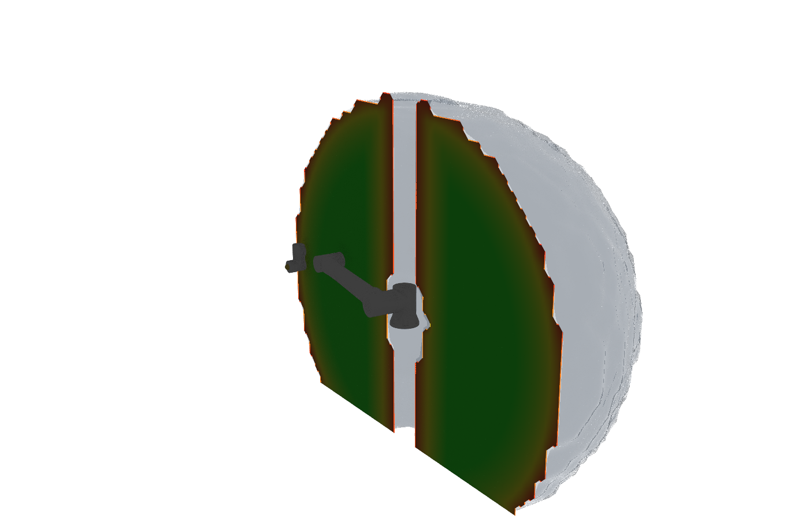
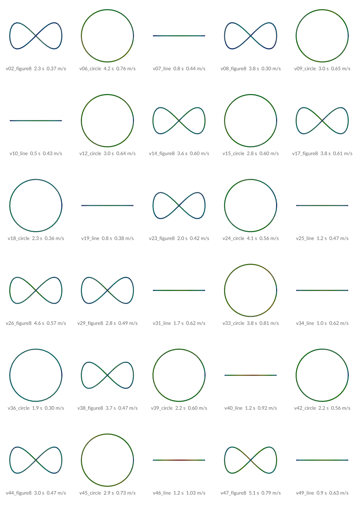
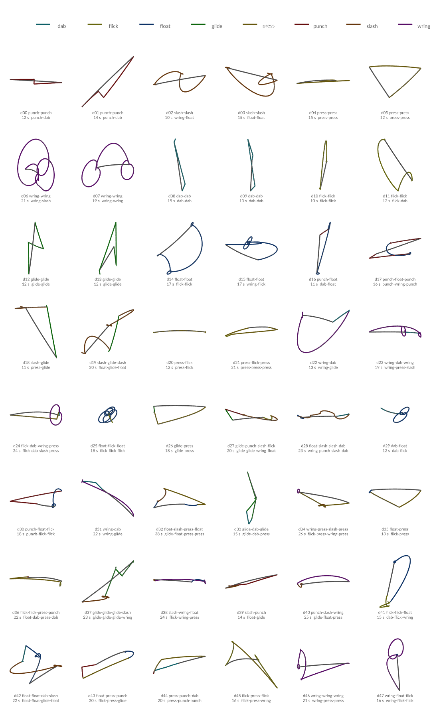
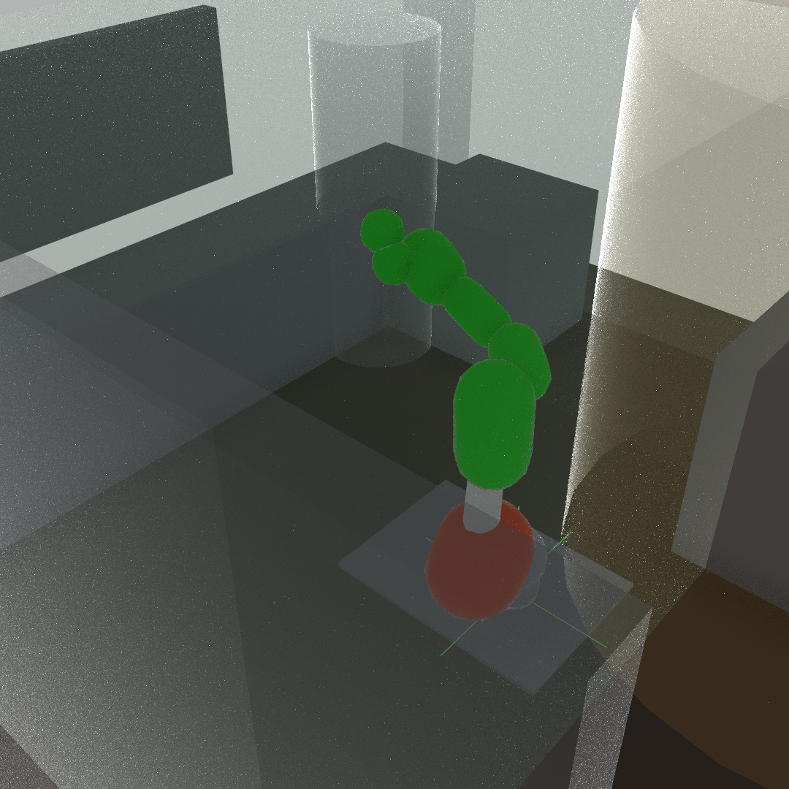
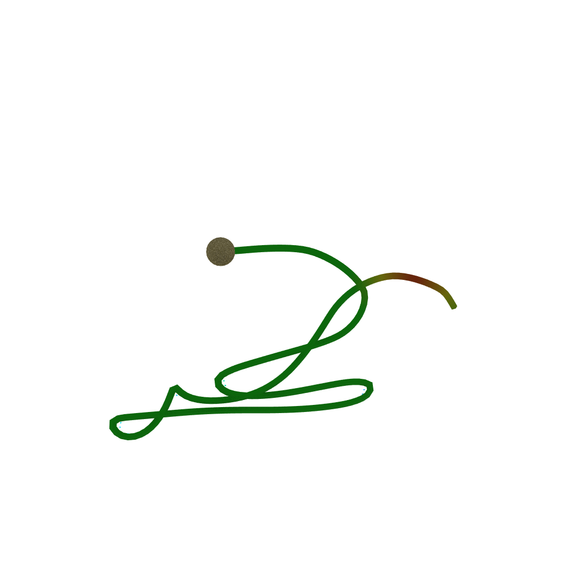

# houdini-robot-toolkit

Houdini toolset for animating a 6-axis robot arm — FK and IK, motion
analysis, and CSV export to a real controller — and the tools around it: a
clip library, a room with collision and safety zones, playback on a Fairino
arm, a show state machine, Isaac Sim views and a tracking test.

Model-agnostic by design: the kinematic specification for a given arm lives
in `profiles/`, not in the assets. Two profiles so far: **UF850** (FBX rig) and
**Fairino FR20** (built from the vendor URDF). The asset reads the profile when
it cooks, so a *locked* instance follows whichever robot its Robot Profile
names.

See [docs/COMMANDS.md](docs/COMMANDS.md) for the commands you run day to day.

## Layout

| Path | Contents |
|---|---|
| `otls/` | Digital assets (runtime binaries) |
| `profiles/` | Per-robot spec JSON — joint limits, axes, sign conventions, output format |
| `scripts/` | Python and VEX: the tools, and the code inside the assets in diffable form |
| `scripts/isaac/` | Isaac Sim scripts (Isaac's own Python) |
| `scenes/` | `.hiplc` scene files |
| `shows/` | Show configs (`<show>.json`), their builds and USD layers |
| `envs/` | Rooms the robot works in, as OpenUSD (`.usda`): obstacles with collision, keep-out / slow / work zones |
| `assets/fbx/` | UF850 source geometry |
| `assets/fairino_description/` | FR20 URDF and link STLs, copied unmodified from FAIR-INNOVATION/frcobot_ros2 (`fairino_description/`), which declares no license |
| `assets/tools/` | The LED strip tool (URDF, STL) |
| `tests/` | Fixtures: joint CSVs, sample clips, a keypoint take, acceleration probe results |
| `docs/` | Design notes and the pictures below |
| `houdini/` | The Houdini package file |
| `geo/` | Generated output (solve cache, atlas, clips, show builds, recordings) — gitignored |

## The asset

`wenyi::robot_arm::1.0` (`otls/sop_wenyi.robot_arm.1.0.hdalc`) wraps the whole
tool. Tabs follow the workflow: **Setup · 1 Motion · 2 Solve · 3 Analyze ·
4 Output · Advanced**.

| Input | |
|---|---|
| 0 | Rest skeleton — optional override of the profile's own skeleton |
| 1 | Goal curve |
| 2 | Goal point — overrides the built-in target when connected |
| 3 | **Tool geometry** |
| 4 | Collision — reserved, unused |

| Output | |
|---|---|
| 0 | Display |
| 1 | **Tool Tip** — one point: `P`, `transform`, `orient` (the achieved tip, not the goal) |
| 2 | Analysis |
| 3 | Posed Skeleton — the KineFX skeleton the active Pose Source produces |

**Tools.** Setup → Tool sets the tool frame relative to the flange face
(`joint_6` plus the profile's `flange_offset_m`), tool axis +Y. The IK goal
is moved back by that frame so the **tip** lands on the goal. **Tool Frame:
From Geometry** (default) reads the TCP from input 3 — a point group or
point named `tcp`, else the centroid of the points furthest along +Y; Tool
Status says when the tip was guessed, so add a `tcp` point when it matters.
**Manual** uses the typed offset. Rotation is always manual. The analysis
measures the tip, not the flange.

**Goal Mode** — what the IK solver aims at: Manual Rig Pose (the Manual TCP
Goal parms), Curve (`CURVE_IN` sampled at Progress) or Point Transform
(`POINT_IN`, else the built-in target). **Orient Mode** is independent of it:

| Orient Mode | Curve goal | Point goal |
|---|---|---|
| Follow | curve **tangent** | the point's own orient (`transform` → `orient` → `N`+`up`) |
| Aim At Target | point the tool at Aim Target | same |
| Fixed Direction | Fixed Tool Direction + Roll | same |

Aim Target is Manual XYZ or **From Object** (SOP geometry: point 0; an OBJ
node: its origin); Aim Object Status says which was resolved.

**Pose Source** — what drives the robot *and* the CSV exporter: FK (manual
joints) / IK (solved) / Imported CSV / Baked IK→FK. Manual FK is typed in
the **robot frame**, clamped to the profile's limits, so what you type is
what the CSV exports.

The solve does not avoid collisions; clips are checked against the room
instead (see [The cell](#the-cell-collision-and-safety-zones-real2sim)).

## `$HIP` is not the project root

Scenes live in `scenes/`, so project-relative paths inside a scene use
`$HIP/../` (`$HIP/../geo`, `$HIP/../envs/volvox_lab.usda`). It works on a
fresh clone with no environment setup.

## scripts/ vs otls/

`otls/` holds what Houdini runs. `scripts/` holds the same code as text
(`scripts/hda/`, `scripts/vex/`, `scripts/callbacks/`) so it can be reviewed
and diffed — a change inside a `.hdalc` is otherwise invisible in a commit.
Keep the two in sync when the asset changes.

## Profiles drive the asset

Joint axes, signs, limits and presets are **expressions** on the internal
nodes, evaluated against the current profile by the asset's PythonModule
(`scripts/hda/robot_arm_module.py`) — not written by a callback, because a
locked instance forbids writes to internal parameters. The Robot Profile menu
lists every `profiles/*.json`; its callback touches only promoted parameters.

Limits are per joint: `robot.max_velocity_deg_s` and
`robot.max_acceleration_deg_s2` are one number or one per joint (FR20:
J1–J3 120, J4–J6 180 deg/s; acceleration measured on the arm with
`accel_ui.py`, planned at J1–J3 300, J4–J6 600 deg/s²). Export, Pre-Flight,
Retime, the analysis and the player all compare each joint to its own limit.

The solve cache is `ik_solve_<profile>_<node>`, so two arms in one scene
never share one.

## Adding a robot from a URDF

`scripts/urdf_rig.py` builds the rest skeleton and places the link meshes from
a URDF: each joint frame is rebuilt so +Y runs down the bone, as KineFX
wants, and classified as a twist or a hinge; a skewed joint raises rather
than producing a wrong rig. `python scripts/urdf_rig.py` checks FR20 against
the URDF and `profiles/fr20.json`.

The asset does this itself when a profile names `rig.urdf` and no `rig.fbx`
(`urdf_skeleton`, `urdf_links`, `urdf_drive`, switched by Python
expressions). Dropping the asset and picking `fr20` is the whole setup;
`scenes/FR20_rig.hiplc` is that. FK matches URDF forward kinematics to 4 µm.

## Closed-form IK (UR-type arms)

`rig.ik_solver` in the profile picks the solver: `fbik` (default, UF850) or
`ur_closed_form` (FR20). `scripts/ur_ik.py` checks the URDF is UR-type,
derives the solve from its zero-pose geometry (no DH table) and returns
every branch, up to 8 (shoulder × elbow × wrist), each kept only if it
reproduces the goal to 1 µm. On FR20 it reaches goals to under 0.001 mm
(FBIK: 3–24 mm), and the controller's own `GetInverseKin` answer is among its
branches. `python scripts/ur_ik.py` runs its tests.

The Solve tab presets (shoulder / elbow / wrist) filter the branches; the
one nearest the previous frame wins. Recache writes frames in order, so a
cached solve is continuous and reproducible. With no admissible branch the
arm gets as near as it can and `ik_ok` reads 0.

## Capability atlas (FR20)

What the arm can do at each point of its workspace, baked into volumes so
paths can be designed against it rather than discovered by Pre-Flight
(`scripts/capability.py`, `scripts/hda/atlas_sop.py`):

| Field | Meaning |
|---|---|
| `reachable` | 1 if the tool reaches the point pointing along Tool Direction |
| `headroom` | m/s: fastest TCP speed in the *worst* direction before a joint hits its velocity limit; 0 at a singularity |
| `wrist` | \|sin q5\|: 0 at the wrist singularity |
| `margin` | degrees to the nearest joint limit |
| `nsol` | branches within limits |
| `clear`, `clearance` | with a Cell Environment: reachable clear of the room and itself; metres beyond the nearest margin |

`hython scripts/build_atlas_scene.py --bake` generates
`scenes/FR20_atlas.hiplc` and bakes the grid through PDG into `geo/atlas/`
(delete the folder after changing the bake); `atlas_check.py` checks it.
`/obj/fr20_atlas/OUT` shows a half shell of the reachable space and a slice
coloured by `headroom`. Along a path: `volumesample(1, "headroom", @P)`
with `atlas_merge` on the second input.



## Clips, the factory and the library

A **clip** (`scripts/motion_clip.py`) is one JSON file shaped like ROS
`JointTrajectory` — `points: [{t, q}]`, `joint_names` — plus the TCP path,
tags, the style that made it, and a **safety** block measured the way the
player plays it (`ok`, and the `reasons` when not).

The **factory** (`scripts/clip_factory.py`) makes clips from a primitive
(line, circle, figure-8) and a style, checks them against the atlas and the
cell, solves and retimes them, and writes rejected ones too, with the
reason. `scenes/FR20_clip_factory.hiplc` wedges it in PDG.



**Dance phrases** (`scripts/choreo.py`) are written in Laban's Effort
vocabulary: each bar names an action (punch, slash, press, wring, dab,
flick, glide, float) and Weight, Time, Space and Flow shape how it moves.
Phrases stay on the beat grid, start and end at rest in HOME, play at their
own speed and clear the cell. `scripts/motion_labels.py` measures the
efforts back from any clip and tags it. In Houdini,
**`wenyi::dance_phrase`** generates a phrase, drives an FR20 `robot_arm`
and exports it (`scenes/FR20_dance.hiplc`).



**The library** (`scripts/clip_library.py`) searches every clip by its
labels and chains clips into one, with minimum-jerk joins where needed:

```
python scripts/clip_library.py search --action punch --level mid
```

`hython scripts/roundtrip_check.py` sends a clip through robot_arm's Import
CSV and back out of its exporter: FR20 CSV, clip JSON and UF850 CSV come
back exact.

**From a person** (`scripts/retarget.py`, keypoints as in
`tests/keypoints/`): **direct** maps the wrist's motion into the workspace,
shrunk and slowed until FR20 can play it; **effort** turns the performer's
Laban efforts into a choreo.py phrase.

## The cell: collision and safety zones (real2sim)

The room is an OpenUSD file, `envs/volvox_lab.usda`, in the robot base frame
(URDF, Z up, metres; the arm's working front is -X). Solaris, Isaac Sim,
usdview and a text editor open it as it is; `scripts/room_usd.py` reads it
for the checks. Each shape has a role, `motionlab:role`:

| Role | Rule |
|---|---|
| `obstacle` | no link or tool within the room's `margin_m` (per-object `margin_m` overrides) |
| `keep_out` | no link inside at all — where the operator stands |
| `slow` | the TCP may not exceed `tcp_speed_mps` inside (ISO/TS 15066-style) |
| `work` | the TCP must stay inside — the stage |

`scripts/collision.py` models FR20 as conservative capsules fitted to its
URDF meshes, plus a tool capsule, with exact clearance to the room and
self-collision.

The file: `/Room/Structure/*` (floor, ceiling, walls as collision slabs),
`/Room/Objects/*` (Cube, Cylinder or Sphere with collision),
`/Room/Zones/*` (guide volumes, never rendered). Edit it in Solaris or as
text; objects and zones turn about Z only. After moving walls,
`python scripts/room_usd.py --rewrite envs/volvox_lab.usda` re-fits slabs
and outlines. A show's own objects are a layer over the room
(`shows/<show>.usda`).

**The room is an estimate from one photo.** Measure it with the arm:
`python scripts/probe_ui.py` records points you hand-guide the tool tip onto
(read-only, never moves the robot) and fits shapes; `scan_to_env.py` adds a
RoomPlan scan placed by the probed walls.

Where it is used: Pre-Flight's **Cell** check (Setup > Cell Environment;
FR20 only), the clip factories, the dance generator, the show build, the
atlas, and `scenes/FR20_cell.hiplc`: the room by role, the FR20 playing any
clip, its capsules coloured by clearance. **Display > Cell (room)** draws
the room in any scene.



## Playback on a Fairino arm

`scripts/fairino_player.py` plays an exported joint CSV on a Fairino
controller by ServoJ streaming (XML-RPC, port 20003, standard library only).
It conditions the whole path first — smooth per joint, at rest at both ends,
uniformly time-scaled to the velocity / acceleration envelope, never
per-joint clipping — MoveJ's to the first sample, streams on absolute
deadlines and reports what happened.

Run it from `python scripts/play_ui.py` (a window, with a STOP button:
StopMotion + ServoMoveEnd, a software stop, not an E-stop) or from
`playback.toml` with `python scripts/play.py`:

| Step | Moves? | Use |
|---|---|---|
| `--dry-run` | no | how much the clip is slowed to fit, peaks per joint |
| `--check` | no | controller model / errors, current pose, FK vs the URDF |
| `--goto-start` | MoveJ only | the clip's first pose |
| `--goto-home` | MoveJ only | the profile's HOME, path checked against `--env` first |
| `--wiggle 6 5 4 2` | small | J6 +5° and back, twice |
| play, `--record actual.csv` | yes | play, and record the actual joints |

Every move names its target, `--sim` or `--hardware`. Speed defaults to 30 %
of the envelope. `--hardware` defaults to a 10 % MoveJ, prints the plan and
waits for `yes`. A recording imports with **Output → Import CSV**
frame-for-frame against the design.

On SimMachine FR20 a clip streams at 125 Hz with 0 skips and ~40 ms lag.
On a physical arm: check, goto-start, wiggle, then the clip at `--speed 0.3`
→ `0.6` → `1.0`, with an operator at the E-stop.

## The show: build, try, run

A show (`shows/<show>.json`: the room, its hubs, the library's recipe, the
canvas, the scan) is built into `shows/<show>.compiled.json` — every motion
made and checked — then played by one state machine (`show.py`'s Runner):
a dry run, Isaac Sim, SimMachine or the FR20. A player refuses a build older
than its inputs.

```
uv run scripts/show.py build shows/party.json
uv run scripts/show_ui.py            # the show's window: target, triggers, stop
```

`show_stream.py` streams the show to SimMachine or the arm (`--hardware`
plays at speed 0.3 and asks first), paced by the controller's playback rate
(`playback.toml`), and pulls its lag back while the arm rests at a hub.
`scan_test_ui.py` runs the scan step by step. In Houdini,
`scenes/FR20_show.hiplc` holds `/obj/robot_show` (`wenyi::robot_show`), the
show on one parameter page — see [docs/show_pipeline.md](docs/show_pipeline.md).

OSC (TouchDesigner): the player listens on 9000 and sends its status to 9001
(show_ui) and each `--osc-out` (TD: 9002). One player holds 9000 at a time:
show_stream, scan_test and Isaac's run_show exclude each other.

## Isaac Sim

Isaac brings its own Python: `C:/isaacsim6/python.bat`. Every Isaac view
loads the lab's room through `isaac_stage.load_room` (the look of the lab's
photos); the safety guides are hidden unless `--guides`.

- **run_show.py** — the show in a window: panel, keys, OSC.
- **TD live** (`--td-live`) — TD hears the show as from show_stream, and its
  LEDs (Art-Net) and canvas preview come back, drawn on the strip and the
  paper. Close show_stream, scan_test and show_ui first.
- **Demos** (`--demo`) — headless, 5 min, from the audience's camera,
  recorded to `geo/isaac/`; with `--td-live` it records what TD sent and
  `replay_render.py` renders it afterwards from any camera.
- **The library review** (`record_library.py`) — every idle clip, the big
  wipes and the scan, as the Houdini review's pages and a contact sheet.
- **run_tracking.py** — the tracking test (below).

## The tracking test

A person followed on top of the clips — a test apart from the party show.

- `scripts/tracking.py` — `TargetInput` (drops low confidence and impossible
  jumps, filters), `Attention` (whom to look at when several are there),
  `Gaze` (small J1 / J5 offsets that turn the tool to the head, bounded,
  kept clear of the room, smoothed by Ruckig).
- `scripts/engage.py` — the interactive mode: step onto the spot in front of
  the greet hub, or wave within 1.2 m of the glass, and the arm stops its
  clip, perks up, follows you, nods goodbye and goes back.
- `scripts/track_runner.py` — the one live loop (greet clips, gaze,
  interactive mode) that Isaac and the SimMachine test both run.
- `scripts/track_osc.py` — OSC in: `/track/hands` + `/track/people`, robot
  base frame, metres.

**One format for sim and the real camera.** `scripts/femto_format.py` is
TouchDesigner's Kinect Azure CHOP as channels: `frame`, `timestamp`, and per
player `pN/id` and `pN/<joint>:tx/ty/tz/confidence` for the 32 Azure Kinect
joints; an empty slot has id 0. `scripts/mocap_scenes.py` stages real people
(CMU mocap, `mocap_cmu.py`) with the Femto's noise and writes them in that
format with `--write-all geo/tracking`: `femto_sim_<scene>.csv`,
`femto_sim_calibration.csv` and `femto_sim_extrinsic.json` (the transform,
the layout and the floor marks). A real recording from TD plays the same
way: `rec:<file.csv>` is a scenario in `track_sim.py`, `track_eval.py` and
`track_runner.py`. `python scripts/track_eval.py` checks every scenario
offline.

**TouchDesigner side** (TD-ROBOT-UVSCAN, `td-modules/people_track`): Source
— Sim (a recording) or Femto (Kinect Azure TOP, Library Orbbec, + Kinect
Azure CHOP) — → `bodies` → OSC to Isaac on 9010 and SimMachine on 9011.
Record writes a recording; Calibrate (stand on 4 floor marks, Kabsch solve,
handedness decided by heads above feet) writes `femto_extrinsic.json`. Off
by default (the Active toggle).

**Running it:**

- Isaac: `run_tracking.py --live --osc-in 9010 [--engage]` (without
  `--osc-in`: drag the person's head; `--people N` for a crowd).
- The interactive mode on its own (SimMachine or the real arm):
  `python scripts/track_ui.py` (track_mode.py) — the start pose, the v9
  idle clips at random, facing the guests less often than the show;
  somebody on the spot and the arm comes to greet and turns to them; End
  goes back to the start pose. On the real arm every move is confirmed.
- SimMachine, greet only: `python scripts/track_test.py --sim --engage`.

**Ports:** 9000 the player's OSC in, 9001 show_ui, 9002 TD's status in,
9010 / 9011 the tracking test's people (Isaac / SimMachine), 6455 Isaac's
LEDs (Art-Net; not 6454, TD and a real node may hold it), 6457 Isaac's
canvas, 7000 TD's agent bridge.

## Conventions

- All assets use the **`wenyi::`** namespace.
- Houdini incremental saves (`backup/`, `otls/backup/`) are gitignored.

## Reading the analysis colours

**3 Analyze** is three groups in workflow order — **Cache** (recache first,
nothing below is valid until you do), **Colour** (read the result),
**Retime** (act on it).

**Colour By** picks the metric; **Colour Scale** decides what red means:
**Profile Limits** (default: red at a fixed value, comparable across clips)
or **Percentile (5–95)** (this clip only; used for `flip_ratio` and
`tcp_speed`, which have no absolute reference).

Colour is reserved for data: the metric ramp owns **blue → cyan → green →
yellow → red**, the bands own green / amber / red, and nothing else uses
them.

| | |
|---|---|
| Achieved path | the metric ramp — **the only thing that carries meaning** |
| Planned curve | white — a reference, not a measurement |
| TCP marker / Aim target | magenta / violet — controls |
| Residual ties | light neutral |
| Problem markers | hot pink |
| Tool | steel grey |

**Pass / Warn / Fail** replaces the ramp with three flat colours against the
profile limits (**Warn At** sets amber). **Problem Frames** markers sit at
the frames the last pre-flight rejected — empty until **Run Pre-Flight
Check** has been pressed. If the analysis looks frozen, the cache is stale
— recache.

**Curve Check** walks the goal curve through the real solve and colours it
by what each pose leaves the robot — reachable, speed headroom, wrist
singularity, joint-limit margin — independent of timing. A red stretch is
hard at any speed: reshape it or change the tool orientation there. FR20
only.



**Retime** plans velocity and acceleration together
(`scripts/retime_topp.py`) and verifies the keyed frames with Pre-Flight's
own check. Keep **Resample Length** fine (5 mm on FR20).

## Pre-flight gate

**4 Output**: **Export CSV · Pre-Flight · Import CSV · Bake IK to FK**.
**Gate Export On Pre-Flight** is on by default and refuses to write a CSV
that fails. Checks run through the same `_collect()` the exporter uses, so
the gate validates exactly what ships.

| Check | Blocks? |
|---|---|
| Joint limits (on the unwrapped values that ship) | **FAIL** |
| Angle continuity — any step over 180° | **FAIL** |
| Unwrap enabled | **FAIL** |
| Joint velocity vs profile max | **FAIL** |
| Cell: link or tool within an obstacle's margin, inside a keep-out zone, TCP too fast in a slow zone or outside the work zone | **FAIL** |
| Robot playback: the player would slow the clip (acceleration) | warn |
| Wrist branch resolved | warn |
| Frame range vs playbar | warn |
| Tracking residual vs tolerance | warn |
| Solve cache vs live solve | warn |

A clip that passes plays at its own speed. **Import CSV** (a joint CSV or a
clip JSON) sets the frame range and switches Pose Source to Imported CSV,
reading the file live. **Quiet (no popup dialogs)** in Advanced keeps modal
dialogs from blocking scripted runs.

## Installing

The scripts run in the project's own environment, managed by
[uv](https://docs.astral.sh/uv/) (`pyproject.toml`, pinned by `uv.lock`):
run `uv sync` once, and after pulling a changed `uv.lock`. Houdini's hython
and Isaac Sim's Python do not use `.venv`.

The toolkit is a Houdini package, `houdini/houdini_robot_toolkit.json`, that
puts `otls/` on `HOUDINI_OTLSCAN_PATH`. Register it once per machine (again
if the repo moves), then restart Houdini:

```
python scripts/install_houdini_package.py
```

Or set `HOUDINI_PACKAGE_DIR=<repo>/houdini`. Without either, a scene falls
back to the copy embedded in the .hip, whose CSV I/O asset has no Python
module: Retime, Export and Import fail with `KeyError: 'PythonModule'`.

## Known issues

- **J4 can unwrap past its limit under FBIK.** The exporter unwraps angles
  so the controller gets continuous values, and that accumulates (UF850's
  drawn curve: −422°). Constrain J4 with Roll Freedom, slow the curve, or
  redraw.
- **FBIK ignores joint limits on J4** (it enforces them on J1/J2/J3/J5);
  rotation weights do bind. Unexplained.
- **FBIK cannot use a range that crosses ±180° without being a full turn.**
  `fbik_range()` trims such a range to ±179°.
- The Colour By `vel_max` scale is one number; the per-joint `vel_ratio` is
  not yet a colour option.
- The internal `TCP_PATH_CTRL/recache_btn` carries an older copy of the
  recache script (not exposed in the UI).
- J3 carries a +90° offset between the Configure Joints frame and the frame
  the analysis and CSV export report in.
- **Send joint angles, not poses.** FR20's URDF matches its controller to
  0.016 mm, but the controller's own IK may pick another branch. URDF and
  controller can disagree across hardware versions: check any new model with
  `--check` (queries only).
